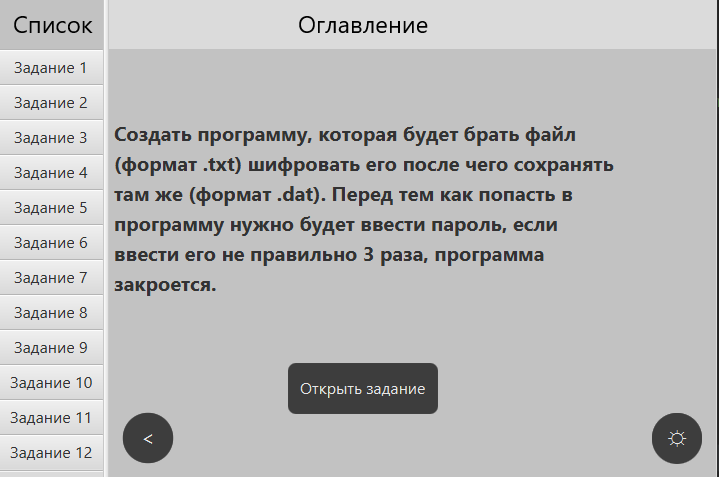
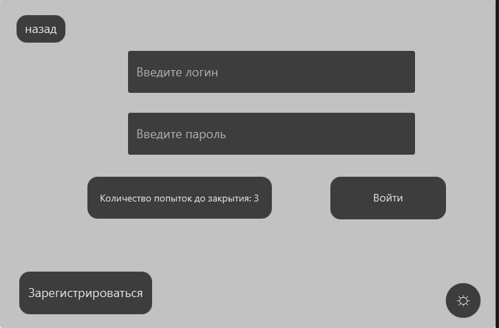
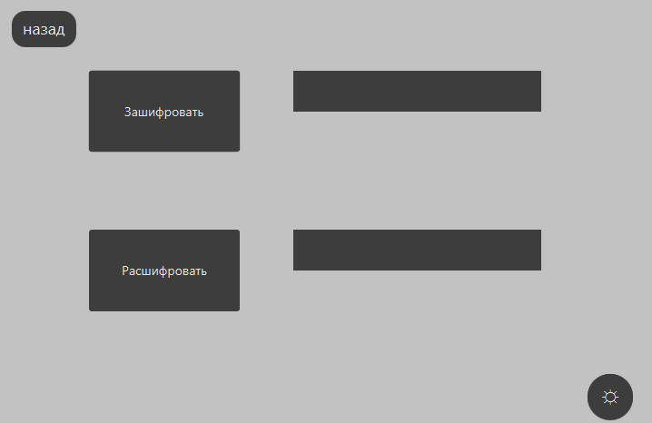
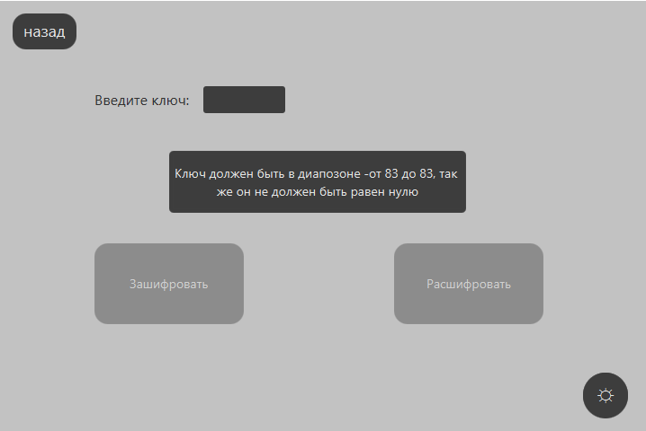
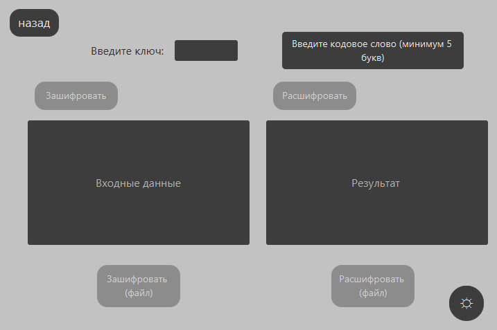
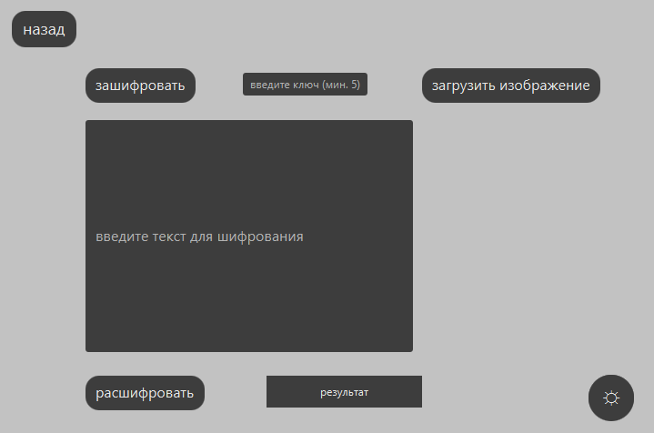
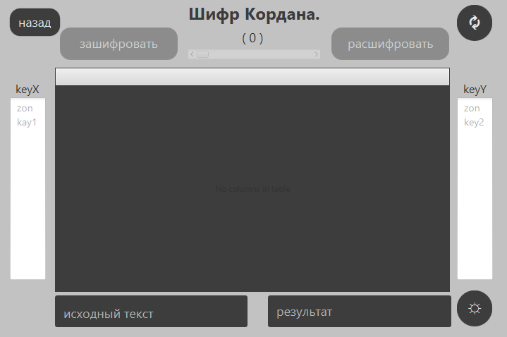
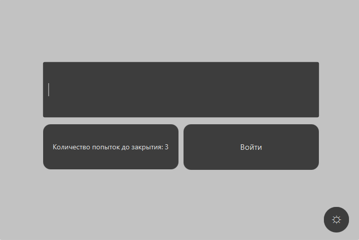
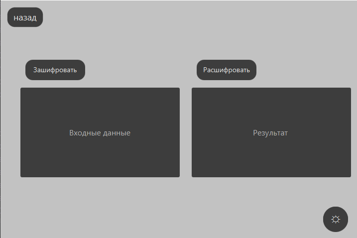

# decode_lab
## Выполнение лабораторной работы по теме "Декодирование"
Нужно было создать рабочие приложение для авторизации, проверка пароля будет происходить на сервере, данные будут хранится в бд. После авторизации у пользователя будет выбор одного из 12 доступных заданий, при нажатии на каждый можно посмотреть, что нужно было реализовать.

При нажатии открыть задание у пользователя будет заменено окно на соответствующее задание. 

Далее будет расмотрен цикл работы проекта.
___
**Окно авторизации.**

Пользователь может войти если у него уже создана учётная запись, если её нет, то можно создать.
После успешной авторизации, пользователь может просмотреть доступные задание и пример уже работающих проектов. 
Рассмотрим каждое из заданий.

**Задание 1:**
Создать программу, которая будет брать файл (формат .txt) шифровать его после чего сохранять там же (формат .dat). Перед тем как попасть в программу нужно будет ввести пароль, если ввести его не правильно 3 раза, программа закроется.

**Задание 2:**
Написать программу на вход которой будет поступать файл (фомат .txt) они будет шифровать методом Цезаря (пользователь вводит сдвиг) после чего шифрует в туже папку (формат .dat). Перед тем как попасть в программу нужно будет ввести пароль, если ввести его не правильно 3 раза, программа закроется.

**Задание 3:**
Написать программу на входе которй пользователь будет вводить ключ (слово), а так же сам текст (или можно загрузить из .txt) и выводить результат шифрования методом Веинера  поле (или в .dat). Перед тем как попасть в программу нужно будет ввести пароль, если ввести его не правильно 3 раза, программа закроется.

**Задание 4:**
Написать программу стеганографию. Перед тем как попасть в программу нужно будет ввести пароль, если ввести его не правильно 3 раза, программа закроется.

**Задание 5:**
Написать программу, которая на вход требует фразу которую нужно зашифровать и ключ для составления сетки, шифрует (показывая сетку) и даёт на выходе последовательнсоть цифр и при внесени в поле шифр зашифрованного текста нажимая кнопку расшифровать будет получен результат. Перед тем как попасть в программу нужно будет ввести пароль, если ввести его не правильно 3 раза, программа закроется.

**Задание 6:**
Создать систему аутентификации с помощью односторонней функции. при входе в программу пользователь будет вводить известный код, после чего данный код будет шифроватся n-раз и проверятся на сервере если он совпадает, тогда сервер разрешит войти.

**Задание 7:**
Создать широфание методом RSA (широфание/дешифрование)

На данный момент это все из доступные решение поставленных задач.